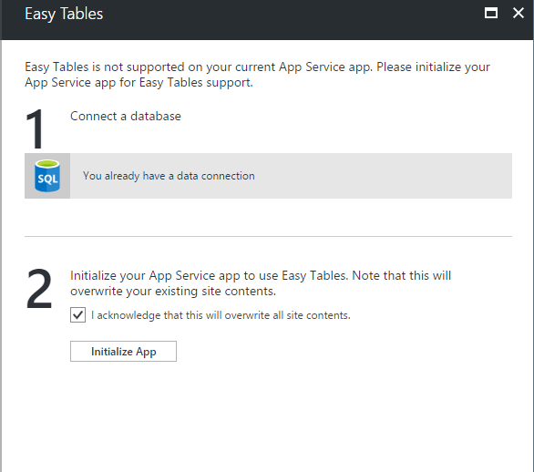
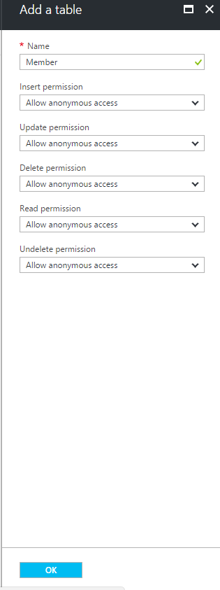

# Mission 4: Retrieving from database with Azure Mobile Apps

## Introduction
We need a way to keep track of the members on our team, let's make a database of our team members, as well as an interface to access it. This challenge will be guided for the most part.

In this mission, we will use the Azure Mobile Apps backend and client SDK.

We will be creating a database table and API in the backend on Azure and then connecting to it using the SDK.

## Creating an Azure Mobile Apps instance
On the Azure Portal, click "New" on the left sidebar.

Search for "Mobile App" and create a new Mobile App. Feel free to use any name you wish.


After the resource has been deployed, click on it and go to "Easy Tables".

Create a new SQL database to connect to if you don't have one, check the box and click "Initialize App".



## Setting up the database

After you're done initializing the app, in the Easy Tables panel, click "Add Table" and create a new table called "Member".



Next, we have to modify the schema and add a new column called "name". This is the column we will use to store the name of our team members.


Let's add in a few rows of data so that we can retrieve it later from our Xamarin Forms application.

First, go back to the "All Resources" page on Azure and select the SQL database that you created for the mobile app previously.

Click on Tools at the top and click "Open in Visual Studio".


Now that you're in Visual Studio, you can connect to the database using your username/password. Right click on "dbo.Member" under tables and select "View Data".

Let's add some sample rows of data to the database. Put the team members' names into the "name" column and the other columns will autofill after pressing enter.


Done! Now we have a fully working database and API powered by Azure Mobile Apps.

## Xamarin Setup

Right-click the solution and install the Nuget package `Microsoft.Azure.Mobile.Client`. If you've forogtten how to install a Nuget, you can refer back to Challenge 2.

## Xamarin UI

Next, let's make a new page to display the information in Xamarin, as well as a new button to lead to the new page.

Right click on the MarsBuddy project and click Add > New Item. Go down to "Cross-Platform" at the side and create a new "Forms Xaml Page". Name it "MembersPage.xaml".

If you've finished Mission 3, constructing this UI should feel familiar to you.

Just like in Mission 3 where we constructed a `MainPage.xaml` with a `ListView`, we'll do something similar over here. 

Let's insert some elements into the xaml to help us construct our UI:

`MembersPage.xaml`:

```xml
<StackLayout Spacing="10" Padding="10" HorizontalOptions="Fill" VerticalOptions="Fill" Orientation="Vertical">
    <Label Text="Member List" VerticalOptions="StartAndExpand" HorizontalOptions="Center" />
    <ListView x:Name="MemberListView"
                VerticalOptions="StartAndExpand"
                HorizontalOptions="Fill"
                >
      <ListView.ItemTemplate>
        <DataTemplate>
          <TextCell Text="{Binding Name}"/>
        </DataTemplate>
      </ListView.ItemTemplate>
    </ListView>
  </StackLayout>
```

Next, we need a method to retrieve the data from Azure and display it in a `ListView`.

`MembersPage.xaml.cs`:

```cs
//Import Azure Mobile Apps SDK
using Microsoft.WindowsAzure.MobileServices;

namespace MarsBuddy
{
	public partial class MembersPage : ContentPage
	{
        public MembersPage ()
        {
            InitializeComponent ();

            //Call data retrieval method
            GetDataAsync();
        }

        public async void GetDataAsync()
        {
            //Initialize SDK to connect to Azure
            var client = new MobileServiceClient("https://marsxam.azurewebsites.net");

            //Retrieve data from Azure
            IMobileServiceTable<Member> memberTable = client.GetTable<Member>();
            List<Member> memberList = await memberTable.ToListAsync();

            //Set the list data
            MemberListView.ItemsSource = memberList;
        }
    }
}
```

## Linking it up
Next, we need to be able to go to the Members page from the Main page.

Let's first add a navigation component to the application.

Go to `App.xaml.cs` and change this code in the constructor:

```cs
public App()
{
    InitializeComponent();

    MainPage = new NavigationPage(new MarsBuddy.MainPage());
}
```

This allows our application to handle navigation between pages.

Now, let's add a button into the Main Page which opens our Members Page.

Go to `MainPage.xaml` and add a new button:

```xml
<Button
    Text="Member List"
    VerticalOptions="End"
    HorizontalOptions="Fill"
    Clicked="OpenMembers"
    />
```
Then in `MainPage.xaml.cs`, trigger a method to open the new page and add it to the navigation stack.

```cs
public async void OpenMembers(object sender, EventArgs args)
{
    await Navigation.PushAsync(new MembersPage());
}   
```

## Conclusion
Done! Now our application has a new page which can retrieve data from a database and API generated by Azure Mobile Apps.